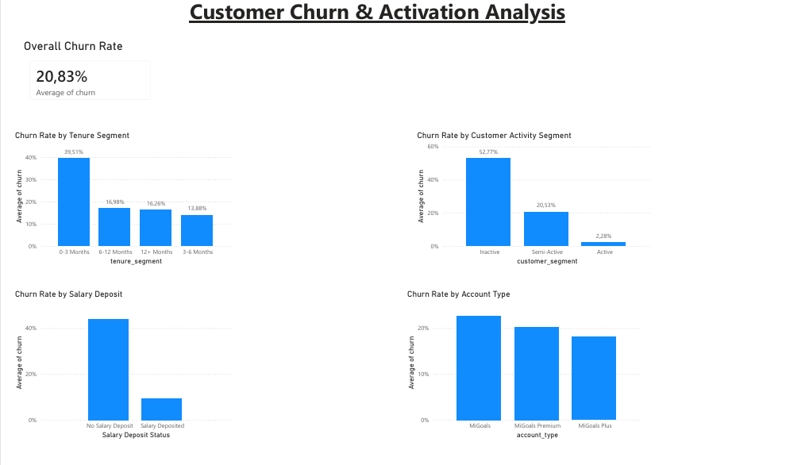

# customer-churn-analysis
Customer churn and account activation analysis using Python, SQL-style analysis, and Power BI
## 🔍 Key Insights
- Highest churn occurs within the first 3 months  
- Inactive customers churn the most  
- Customers without salary deposits are at highest risk  
- Entry-level accounts show higher churn  

## 🧠 Approach
- Data simulation based on real-world banking behavior  
- Python for analysis and modeling  
- SQL-style aggregation for insights  
- Logistic Regression model (~78% accuracy)  
- Power BI dashboard for visualization  

## 🛠 Tools Used
- Python (Pandas, Scikit-learn)  
- Power BI  
- SQL-style analysis  

## 📈 Dashboard

